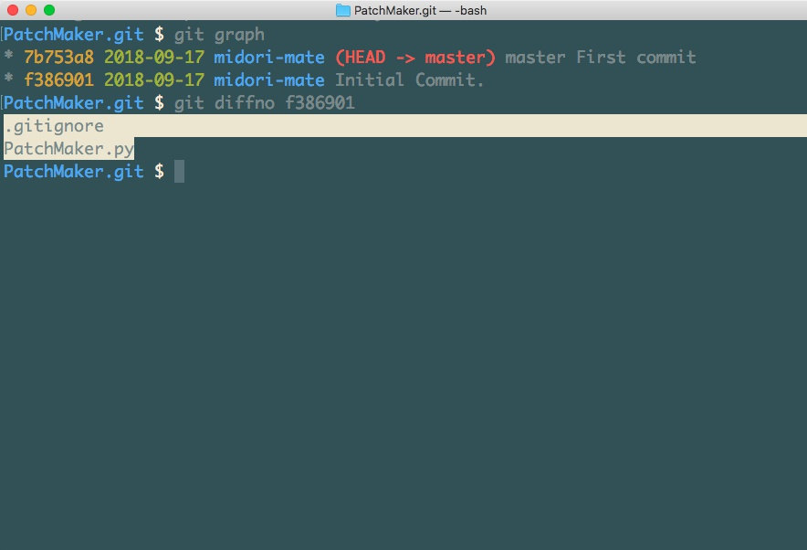

PatchMaker
===

選択したファイルやディレクトリを、タイムスタンプ付きのパッチディレクトリ (`YYYYmmdd_HHMMSS_patch`) へ相対パスを保ったままコピーするツールです。

## すぐ試す

Docker があれば、 clone したディレクトリで次を実行するだけで試せます。 `PatchMaker.py` 冒頭の `targetpaths` に書かれた 2 ファイルを用意して、パッチを作ります。

```bash
mkdir -p project/html && echo one > project/html/html1.html && echo two > project/html/html2.html
docker build -t patch-maker .
docker run --rm -e TZ=Asia/Tokyo --user "$(id -u):$(id -g)" -v "$PWD:/app" patch-maker
```

起こること:

- 次のように表示され、終了コード 0 で終わります (時刻は実行時のものになります) 。

```text
[]
<INFO> 0 files above were not found and were ignored.
<INFO> Succeeded! 2 patch files were created. They are not shown on console.
<INFO> Patch directory: 20261008_162906_patch
```

- 次のファイルができます。元のファイルは変更されません。

```text
20261008_162906_patch/project/html/html1.html
20261008_162906_patch/project/html/html2.html
```

パスを引数で渡すこともできます。外を指すパスは拒否され、存在しないパスは無視されます。

```bash
docker run --rm -e TZ=Asia/Tokyo --user "$(id -u):$(id -g)" -v "$PWD:/app" patch-maker python PatchMaker.py project/html/html1.html ../secret.txt missing.txt
```

```text
['../secret.txt']
<INFO> 1 paths above were rejected (rooted, .git or outside this directory).
['missing.txt']
<INFO> 1 files above were not found and were ignored.
<INFO> Succeeded! 1 patch files were created. They are not shown on console.
<INFO> Patch directory: 20261008_162907_patch
```

コピーできるパスが 1 つもない場合 (`python PatchMaker.py missing.txt` など) は、パッチディレクトリを作らず `<ERROR> No files to copy. The patch directory was not created.` を表示して終了コード 1 で終わります。

## Usage



- git で変更されたファイルパス一覧を取得します。
- それを `PatchMaker.py` 冒頭の `targetpaths` 文字列へ貼り付けます。
- 実行します。パスは `PatchMaker.py` があるディレクトリ (PyInstaller などで実行ファイルにした場合は実行ファイルがあるディレクトリ) からの相対パスとして扱います。
- パッチディレクトリが `PatchMaker.py` と同じディレクトリに作成され、その名前と、コピーしたパスの件数 (ディレクトリは 1 件と数えます) が表示されます。同名のディレクトリが既にある場合は `_2` 、 `_3` のように連番を付けます。
- 存在しないパスは一覧表示され、コピーされません。
- コピーできるパスが 1 つもない場合は、パッチディレクトリを作成せず、エラーを表示して終了コード 1 で終了します。
- 読み取り権限がないなどの理由でコピーに失敗した場合は、作りかけのパッチディレクトリを削除し、失敗したパスと理由を 1 行ずつ表示して終了コード 1 で終了します。 読み取り専用のコピーには書き込み権限を付けてから削除します。それでも削除できなかった場合は、残ったパッチディレクトリの名前を表示します。

### パスの扱い

- 各行の前後の空白と改行コード (CRLF の `\r` を含みます) は取り除きます。空行は無視します。
- `"` で囲まれ、 git の形式でエスケープされた行 (`"d/\346\227\245.txt"` など) は元のファイル名へ戻します。
- 絶対パス、ドライブ付きのパス (Windows の `C:foo` など) 、ディレクトリ全体 (`.`) 、 `..` で外を指すパスは拒否します。拒否したパスは一覧表示され、コピーされません。
- シンボリックリンクはリンク先の内容をコピーします。ただし次のリンクは対象外です。
    - 指定したパス自体やその途中のディレクトリがリンクで、実体がこのディレクトリの外にある場合は拒否します。
    - コピーするディレクトリの中にあり、リンク先が存在しない、このディレクトリの外、コピー中のディレクトリの祖先 (ループ) 、または同じ指定パスの中でコピー済みのディレクトリを指すリンクはコピーせず、一覧表示します。 Windows のジャンクションも同じ扱いです。
- `.git` を含むパス (`.git/config` や `sub/.git` など) は拒否します。コピーするディレクトリの中にある `.git` (サブモジュールの `.git` ファイルを含みます) はコピーせず、一覧表示します。
- ディレクトリを指定すると、 git で管理していないファイル (`.env` など) も含めて中身をすべてコピーします。サブモジュールの更新では `git diff --name-only` がディレクトリを出力するため、配布前にパッチの中身を確認してください。
- パスの存在確認とリンクの判定は、 `a/../b` を `b` のように正規化したパスで行います。
- 同じパスを複数回指定しても 1 回だけコピーします。見つからないパスと拒否したパスは、表記が同じ場合だけ 1 回にまとめて報告します。
- ディレクトリとその配下のパスを同時に指定した場合は、ディレクトリだけをコピーします。 大文字と小文字を区別しないファイルシステム (macOS や Windows の既定) で `D/f.txt` と `d` のように表記が違う場合も、エラーにせず同じディレクトリへまとめてコピーします。
- コピーはパスの辞書順で行います。

### Python で実行する

Python 3.13 以上が必要です。外部ライブラリは使いません。

```bash
python PatchMaker.py
```

`targetpaths` を書き換える代わりに、パスをコマンドライン引数で渡せます。 `-` だけを渡すと、標準入力から 1 行 1 パスで読み込みます。標準入力は OS の文字コード設定によらず UTF-8 (BOM 付きも可) として読み込みます。 UTF-8 として不正なバイト列は、 Linux などではファイル名のバイト列としてそのまま扱います。どちらの場合もパスは `PatchMaker.py` があるディレクトリからの相対パスとして扱います。 `-h` または `--help` だけを渡すと、使い方を表示して終了します。 git は日本語などのファイル名を既定で `"\346..."` の形式で出力しますが、この形式の行も元のファイル名として読み込みます。

```bash
python PatchMaker.py project/html/html1.html project/html/html2.html
git diff --name-only HEAD~1 | python PatchMaker.py -
```

### Docker で実行する

```bash
docker build -t patch-maker .
docker run --rm -e TZ=Asia/Tokyo --user "$(id -u):$(id -g)" -v "$PWD:/app" patch-maker
```

- 標準入力を使う場合は `git diff --name-only HEAD~1 | docker run --rm -i -e TZ=Asia/Tokyo --user "$(id -u):$(id -g)" -v "$PWD:/app" patch-maker python PatchMaker.py -` のように `-i` を付けます。
- `-e TZ=Asia/Tokyo` を省くと、パッチ名の時刻はコンテナの UTC になります。
- `--user` を省くと、 Linux ではパッチディレクトリの所有者が root になります。

## Development

テストと lint は Docker で実行できます。

```bash
docker build -t patch-maker .
docker run --rm patch-maker sh -c 'ruff check . && ruff format --check . && pytest -q'
```

ローカルでは Python 3.13 以上の環境へ `pip install -r requirements-dev.txt` を実行したあと、 `ruff check .` 、 `ruff format --check .` 、 `pytest` で実行できます。開発用ライブラリのバージョンは `requirements-dev.txt` で、 Docker のベースイメージは `Dockerfile` のダイジェストで固定しています。

GitHub Actions の CI (`.github/workflows/ci.yml`) でも同じ lint とテストを、 Python 3.13 と 3.14 で実行します。

作業記録は [docs/iona-kest.md](docs/iona-kest.md) にあります。
